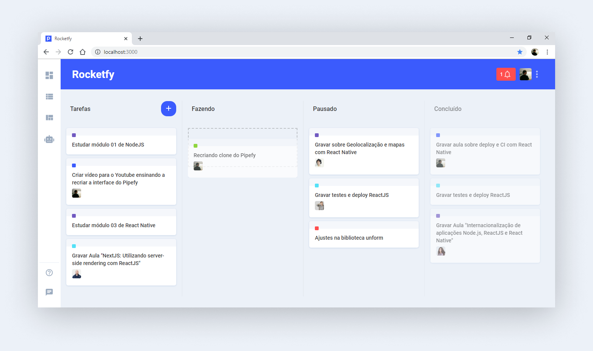

# Rocketfy


## Sobre o projeto
Aplicação clone da interface do [Pipefy](https://www.pipefy.com/pt-br), desenvolvida em ReactJS, utilizando [React DnD](https://react-dnd.github.io/react-dnd) (drag n' drop).

[Tutorial completo aqui](https://www.youtube.com/watch?v=awRtgpRsdTQ), fornecido pela [Rocketseat](https://rocketseat.com.br).

## Instalação
Clone este repositório
```
git clone https://github.com/robertomendoncaa/rocketfy.git
```
Instale as dependências dentro da pasta `rocketfy`
```
yarn
```
Rodar aplicação
```
yarn start
```
